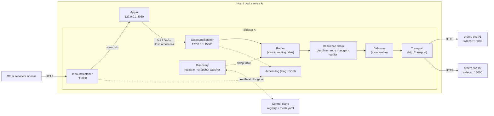
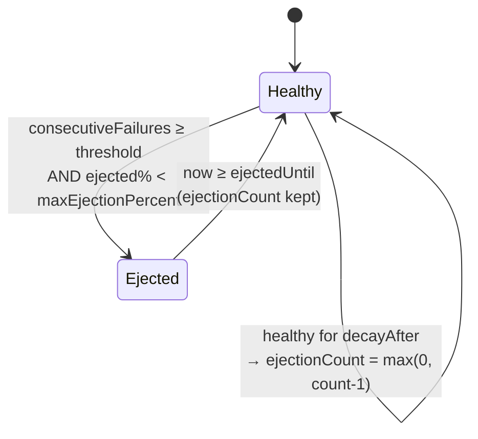
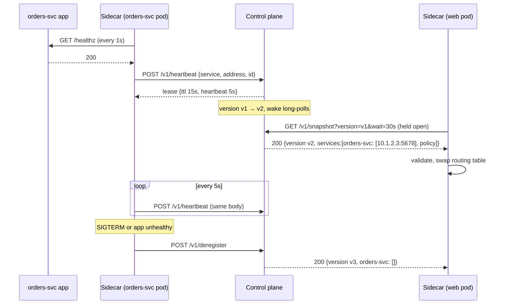

# Sidecar — Design Document

Status: **Draft v1** · Scope: learning project · Language: Go 1.26 (stdlib + `gopkg.in/yaml.v3`)

Related: [CONFIG.md](CONFIG.md) (configuration reference) · [QUESTIONS.md](QUESTIONS.md) (decisions log & open questions)

---

## 1. Overview

The sidecar is a small process that runs next to every service instance and handles
**service-to-service HTTP communication** on the app's behalf:

- **Outbound**: the app sends its request to `127.0.0.1:15001` naming the target service in the
  `Host` header (or as an absolute URI, the way any HTTP proxy is addressed); the sidecar resolves
  that name to a set of instances, load-balances, enforces deadlines, retries safely and
  ejects unhealthy instances.
- **Discovery (control plane)**: every sidecar registers its own instance with the control plane
  while its app is healthy, renews it with heartbeats, and long-polls the control plane for a
  snapshot of every service's instances and policy. Nothing is configured per service or per
  instance by hand (§13).
- **Inbound (minimal pass-through)**: other services reach this app through the sidecar's
  public port `:15000`; the sidecar stamps request context (request id, trace, deadline),
  forwards to the app on `127.0.0.1:8080` and writes an access log.

### 1.1 Goals (v1)

| # | Goal |
|---|------|
| G1 | Explicit HTTP/1.1 proxy, services addressed by `Host` (see [QUESTIONS.md](QUESTIONS.md) D1) |
| G2 | Dynamic discovery: self-registration with leases, versioned snapshots from a control plane, zero manual config per service (§13) |
| G3 | Round-robin load balancing over healthy instances |
| G4 | Per-instance outlier ejection |
| G5 | Safe retries (idempotent only) protected by a retry budget |
| G6 | End-to-end deadline propagation |
| G7 | Request context stamping on inbound (`X-Request-Id`, `traceparent`, deadline) |
| G8 | Structured JSON access logs |
| G9 | Clear error model distinguishing sidecar failures from upstream failures |
| G10 | Modular protocol layer so gRPC/TCP can be added later without rewrites |

### 1.2 Non-goals (v1)

- Transparent interception (iptables), raw TCP, gRPC/HTTP2, messaging.
- TLS / mTLS (a `Transport` seam is reserved for it).
- Prometheus metrics, OpenTelemetry export, admin API (logs only).
- Watching the Kubernetes API, a highly available or persistent control plane, authenticated
  registration (§13.8).
- Inbound auth, rate limiting, request/response transformation.
- Correlating an inbound request with the app's outbound calls (impossible without app help — see §4).

---

## 2. Architecture



Key point: **upstream instances are other sidecars' inbound ports**, not apps directly. Every
hop is therefore sidecar → sidecar, which is what makes deadline and context propagation
consistent across the mesh.

### 2.1 Ports

| Listener | Default bind | Who connects | Purpose |
|---|---|---|---|
| inbound | `0.0.0.0:15000` | other sidecars | public entry to this app |
| outbound | `127.0.0.1:15001` | local app only | app's gateway to other services |
| admin | `0.0.0.0:15020` | kubelet, operators | `/healthz`, `/readyz`, `/snapshot` |
| app | `127.0.0.1:8080` | inbound listener | the real service (must bind localhost only) |

The outbound listener **must** bind to loopback — otherwise anyone on the network could use
the sidecar as an open proxy into the mesh.

---

## 3. Request lifecycle

### 3.1 Outbound

```mermaid
sequenceDiagram
    participant App
    participant S as Sidecar (outbound)
    participant U1 as orders-svc #1
    participant U2 as orders-svc #2

    App->>S: GET /v1/orders/42<br/>Host: orders-svc<br/>X-Sidecar-Deadline, X-Request-Id, traceparent
    S->>S: 1. read Host → service "orders-svc"; path stays "/v1/orders/42"
    S->>S: 2. lookup service in routing table (else 404 no_route)
    S->>S: 3. compute deadline (header vs route timeout)
    S->>S: 4. pick healthy instance (round-robin)
    S->>U1: 5. forward, X-Request-Timeout-Ms = remaining
    U1-->>S: 503
    S->>S: 6. classify: retriable failure → record outlier failure
    S->>S: 7. eligible? method idempotent ∧ budget ok ∧ time left
    S->>S: 8. backoff with jitter
    S->>U2: 9. retry on a different instance
    U2-->>S: 200
    S-->>App: 200 (body streamed)
    S->>S: 10. access log
```

Steps in detail:

1. **Read the service name** from the request: `URL.Host` if the app sent an absolute URI (the
   form an HTTP proxy receives, i.e. what `http_proxy=` produces), else the `Host` header. The
   port, if any, is dropped and the name is lower-cased. The path and query are **never**
   touched. Missing name → `400`; unknown name → `404 no_route`.

   > **Why `Host` and not a `/<service>/` path prefix** (decision D1 in [QUESTIONS.md](QUESTIONS.md)):
   > the sidecar claims no part of the app's URL space, so paths, redirects and cookies need no
   > rewriting, and an app can reach the mesh with `HTTP_PROXY=127.0.0.1:15001` and an unmodified
   > HTTP client. It also matches how a service is named in DNS, so the app's code reads
   > `http://orders-svc/v1/orders/42` either way.
2. **Route lookup** in the current immutable `*RoutingTable` (loaded once per request from an
   `atomic.Pointer`; the request uses that snapshot for its whole life).
3. **Deadline** — see §5.3.
4. **Pick instance** via the service's `Balancer`, skipping ejected instances and, on retries,
   the instances already tried (if any other is available).
5. **Forward** through `httputil.ReverseProxy`-style logic: strip hop-by-hop headers, append
   `X-Forwarded-For`, set `X-Request-Timeout-Ms`, per-attempt `context.WithDeadline`.
6. **Classify** the attempt result (§5.1) and report it to the `OutlierDetector`.
7. **Retry decision** (§5.2).
8. **Backoff** (§5.2.3), bounded by remaining deadline.
9. **Retry** or give up.
10. **Respond** — upstream response passes through untouched; sidecar-generated failures use
    the error model (§7). Log one access-log line per *request* (with attempt count), not per attempt.

### 3.2 Inbound

1. Accept request on `:15000`.
2. **Stamp context**:
   - `X-Request-Id`: keep if present and valid (≤ 128 chars, printable ASCII), else generate (random 16 bytes, hex).
   - `traceparent`: keep if valid W3C format, else generate a new trace; always generate a new parent-span id for this hop.
   - Deadline: read `X-Request-Timeout-Ms`; if absent/invalid use `inbound.defaultTimeout`; clamp to `inbound.maxTimeout`.
     Convert to an **absolute local deadline** and set `X-Sidecar-Deadline: <unix-ms>` for the app (§5.3).
3. Forward to the app with `context.WithDeadline`. If the deadline expires → `504 deadline_exceeded`.
4. Access log.

Inbound does **no** retries, load balancing or ejection — there is exactly one app.

---

## 4. App contract

The sidecar cannot know which inbound request caused a given outbound call (the app may
handle many requests concurrently on many goroutines). So propagation needs one small piece of
cooperation from every app:

> **When handling an incoming request, copy these headers from it onto every outbound call made
> through the sidecar:**
>
> | Header | Set by | Meaning |
> |---|---|---|
> | `X-Request-Id` | inbound sidecar | correlates logs across services |
> | `traceparent` | inbound sidecar | W3C trace context |
> | `X-Sidecar-Deadline` | inbound sidecar | absolute deadline in unix ms, **local clock** |
>
> Optionally set `Idempotency-Key` on POST requests that are safe to retry.

If the app does not forward them, things still work: the outbound sidecar starts a new
request id / trace and uses the route timeout. You only lose correlation and deadline shrinking.

Apps **address** services by name, either per request or once via the proxy environment:

```bash
curl -H 'Host: orders-svc' http://127.0.0.1:15001/v1/orders/42   # name it per request
HTTP_PROXY=http://127.0.0.1:15001 curl http://orders-svc/v1/orders/42   # or configure it once
```

The path is the upstream's own, so `/orders-svc/...` is a *path on some service*, not a route to
`orders-svc`. Apps **must not** follow upstream redirects blindly (see §10, `Location` rewriting).

---

## 5. Resilience semantics

### 5.1 Attempt classification

| Outcome | Retriable? | Counts as outlier failure? |
|---|---|---|
| Connection refused / reset before request written / DNS failure | yes (always safe, request not sent) | yes |
| Per-attempt timeout (no response headers in time) | yes, if method eligible | yes |
| `502`, `503`, `504` from upstream | yes, if method eligible | yes |
| Upstream response with `X-Sidecar-Error` (the *upstream sidecar* failed) | same as its status | no (the instance's sidecar is alive; its dependency failed) |
| `500`, other `5xx` | no | no (application bug, not instance health) |
| `429` | no | no |
| `4xx`, `2xx`, `3xx` | no | success (resets consecutive failures) |
| Client (app) cancelled | no | no |

### 5.2 Retries

#### 5.2.1 Eligibility — all must hold

1. Attempt classified retriable (§5.1).
2. Method is `GET`, `HEAD`, `OPTIONS`, `PUT`, `DELETE`, **or** `POST`/`PATCH` with a non-empty
   `Idempotency-Key` header. *Exception*: connection failures where the request was provably
   never written are retriable for any method.
3. Attempts so far `< retry.maxAttempts` (default 3 total attempts).
4. Request body is replayable: body size ≤ `retry.maxBodyBytes` (default 1 MiB). The sidecar
   buffers bodies up to that size; larger or unknown-length bodies are streamed and **not retried**.
5. Retry budget allows it (§5.2.2).
6. Remaining deadline after backoff ≥ `retry.minAttemptTime` (default 20 ms) — no point starting
   an attempt that cannot finish.

#### 5.2.2 Retry budget (per upstream service)

Prevents retry storms: when an upstream is overloaded, retries multiply its load.

- Keep two counters over a sliding window of `retry.budget.window` (default 10 s, 10 one-second buckets):
  `requests` (first attempts) and `retries`.
- A retry is allowed iff
  `retries < retry.budget.ratio × requests + retry.budget.minPerSecond × window_seconds`
  (defaults: ratio `0.2`, minPerSecond `3`).
- The floor lets low-traffic services still retry; the ratio caps extra load at ~20%.
- When denied, return the last upstream response as-is (if one exists) and log `retry_budget_exhausted`;
  if there was no response (connect failure), return `503` with `X-Sidecar-Error: retry_budget_exhausted`.

#### 5.2.3 Backoff

Full jitter exponential:

```
sleep = random(0, min(retry.backoff.max, retry.backoff.base × 2^(attempt-1)))
```

defaults: base `25ms`, max `250ms`. Sleep is `select`-ed against the request context so a
deadline or client cancel interrupts it.

### 5.3 Deadlines

Two header forms, because clocks differ between hosts but not within one host:

| Header | Where | Format | Why |
|---|---|---|---|
| `X-Request-Timeout-Ms` | **on the wire** between sidecars | remaining ms (integer) | immune to clock skew between machines |
| `X-Sidecar-Deadline` | **inside the host**, inbound sidecar → app → outbound sidecar | absolute unix ms | same clock; automatically accounts for time the app spent before calling out |

**Outbound computation** for a request:

```
now          = local clock
routeTimeout = service.timeout (default 5s)
if X-Sidecar-Deadline valid:   deadline = min(header, now + routeTimeout)
else if X-Request-Timeout-Ms:  deadline = now + min(header, routeTimeout)   // app talked to us with relative form
else:                          deadline = now + routeTimeout
if deadline <= now: 504 deadline_exceeded (no attempt made)

per attempt:
  attemptDeadline = min(deadline, now + service.perTryTimeout)   // perTryTimeout optional
  send X-Request-Timeout-Ms = attemptDeadline - now
```

**Worked example A → B → C** (route timeouts 5s everywhere, network ~5 ms per hop):

| t (ms) | Event | Budget |
|---|---|---|
| 0 | Client hits sidecar A inbound, no header | default inbound timeout 3000 → A-app gets `X-Sidecar-Deadline = t0+3000` |
| 400 | A-app calls B via outbound sidecar A, forwarding deadline | remaining 2600 → wire `X-Request-Timeout-Ms: 2600` |
| 405 | Sidecar B inbound | B-app deadline = local now + 2600 |
| 1405 | B-app (spent 1000 ms) calls C | remaining ~1600 → wire `1600` |
| 1410 | Attempt to C#1 fails fast with 503 at 1500; backoff 30 ms | remaining ~1070 |
| 1530 | Retry to C#2 with `1070` | … |
| 3000 | If still no response, every level times out together; nobody keeps working on a dead request | |

Without propagation, C would happily work for 5 s on a request A gave up on at 3 s.

### 5.4 Outlier ejection (per instance)



- `consecutiveFailures ≥ outlier.consecutiveFailures` (default 5) → eject.
- Ejection duration = `min(outlier.baseEjection × ejectionCount, outlier.maxEjection)`
  (defaults 30 s, 5 min). Repeat offenders stay out longer.
- **Max ejection percent** (default 50%): if ejecting would push ejected instances above this
  share of the pool, don't eject. With 1 instance, 50% means it is never ejected — deliberate:
  failing fast with no instances helps nobody.
- No active health checks in v1: an instance returns to the pool when its timer expires, and the
  next real request is the probe.
- State is stored per instance with `sync/atomic` counters and a small mutex for transitions.

### 5.5 Load balancing

Round-robin with an `atomic.Uint64` counter over the instance list; skip ejected (and, on retry,
already-tried) instances, scanning at most `len(instances)` positions. None available →
`503 no_healthy_upstream`.

---

## 6. Component design

Interfaces keep protocols, algorithms and config sources swappable.

```go
// Protocol is one proxied protocol (v1: "http"). gRPC/TCP later implement the same.
type Protocol interface {
    Name() string
    // ServeOutbound / ServeInbound block until ctx is cancelled, then drain.
    ServeOutbound(ctx context.Context, ln net.Listener, deps Deps) error
    ServeInbound(ctx context.Context, ln net.Listener, deps Deps) error
}

type Deps struct {
    Table  *atomic.Pointer[RoutingTable]
    Logger *slog.Logger
    Clock  Clock // injectable for tests
}

// RoutingTable is immutable once built.
type RoutingTable struct {
    Services map[string]*Service
}

type Service struct {
    Name      string
    Timeout   time.Duration
    PerTry    time.Duration
    Balancer  Balancer
    Retry     RetryPolicy
    Budget    *RetryBudget
    Instances []*Instance
}

type Instance struct {
    // Addr is bare host:port, exactly as configured: no scheme, because v1
    // dials plain HTTP and TLS belongs to Transport, not to per-instance
    // config (decision D2 in QUESTIONS.md). One canonical string means the
    // config file, the access log and the outlier key never disagree.
    Addr    string            // "10.0.0.7:15000"
    Outlier *OutlierState     // carried over across snapshots (see §8)
}

type Balancer interface {
    // Pick returns a healthy instance not in exclude, or nil.
    Pick(exclude map[*Instance]struct{}) *Instance
}

type RetryPolicy interface {
    ShouldRetry(req *http.Request, attempt int, res AttemptResult) bool
    Backoff(attempt int) time.Duration
}

type OutlierDetector interface {
    Report(inst *Instance, res AttemptResult)
    IsEjected(inst *Instance, now time.Time) bool
}

// Transport sends one attempt. v1 wraps *http.Transport; TLS/mTLS plugs in here.
type Transport interface {
    RoundTrip(*http.Request) (*http.Response, error)
}

// Sidecar side: startup config once, then everything else from the control plane (§13).
cfg, err := config.LoadSidecar(path, os.Getenv) // file optional, SIDECAR_* env wins; error -> exit 1
sc := sidecar.New(cfg, log)                     // routes start empty: 503 mesh_not_ready
sc.Run(ctx)                                     // registrar + watcher; returns after deregistering

// Control-plane side: config.Source owns mesh.yaml: load, validate, store, poll, swap (§8).
mesh, err := config.New(path)                   // first load; error -> exit 1
mesh.Current() *config.Mesh                     // immutable snapshot, read once per use
mesh.OnChange(func(old, next *config.Mesh))     // runs after a reload is committed

type AttemptResult struct {
    Status      int
    Err         error
    Class       Class // Success, ConnectFailure, Timeout, GatewayError, NonRetriable
    RequestSent bool
}
```

### 6.1 Package layout

```
cmd/sidecar/            main: flags, load config, start listeners, signal handling, deregister-then-drain
cmd/controlplane/       main: load mesh.yaml, serve the registry API, expire leases
internal/config/        both files: YAML structs, defaults, validation, config.Source (mesh poll + swap),
                        and the snapshot rules a sidecar re-checks
internal/meshapi/       the sidecar ↔ control plane wire types and paths
internal/controlplane/  registry (leases, versions, wake-ups) and its HTTP server
internal/discovery/     sidecar side: control-plane client, registrar, snapshot watcher
internal/routing/       RoutingTable build from config, state carry-over
internal/balancer/      round-robin
internal/resilience/    deadline, retry policy, retry budget, outlier detector
internal/proxy/http/    HTTP Protocol: outbound handler, inbound handler, header utils
internal/errors/        sidecar error codes + JSON writer
internal/logging/       slog setup, access log helper
internal/sidecar/       wiring: discovery -> routing store -> proxy, admin endpoints;
                        shared by main and the e2e harness so tests exercise what ships
docs/                   this documentation
```

`internal/balancer`, `internal/resilience` and `internal/errors` do not exist yet; that code lives
in `internal/proxy` until the features that need the split land.

---

## 7. Error model

Sidecar-originated responses always carry `X-Sidecar-Error` and a JSON body; upstream
responses pass through byte-for-byte (minus hop-by-hop headers).

```http
HTTP/1.1 503 Service Unavailable
Content-Type: application/json
X-Sidecar-Error: no_healthy_upstream
X-Request-Id: 7f3a...

{"code":"no_healthy_upstream","message":"all 3 instances of orders-svc are ejected","service":"orders-svc","requestId":"7f3a..."}
```

| Code | Status | When |
|---|---|---|
| `no_route` | 404 | `Host` names no service in the table (empty `Host` → `400`) |
| `mesh_not_ready` | 503 | no snapshot from the control plane yet, so no name can be resolved (§13.5) |
| `no_healthy_upstream` | 503 | balancer returned nil |
| `upstream_connect_failed` | 502 | last attempt couldn't connect, no response to return |
| `deadline_exceeded` | 504 | deadline passed before or during attempts |
| `retry_budget_exhausted` | 503 | retry needed, budget denied, no response to return |
| `request_too_large` | 413 | body exceeds `limits.maxBodyBytes` |
| `app_unavailable` | 502 | inbound: local app not reachable |

Rule: **if the sidecar has a real upstream response, it returns it** rather than inventing an
error. Sidecar errors only happen when there is nothing better to return.

---

## 8. Configuration & hot reload

Config file formats: see [CONFIG.md](CONFIG.md). There are two files, owned by two processes:

| File | Read by | Holds | Changes |
|---|---|---|---|
| `sidecar.yaml` (optional) | each sidecar | listeners, local app, control-plane address, own identity | at startup only; in Kubernetes it is environment variables and no file |
| `mesh.yaml` | the control plane | per-service policy, lease TTL | hot-reloaded, delivered in snapshots |

Instances are in neither: they register themselves (§13).

**`mesh.yaml` hot reload** (the machinery the old per-sidecar file had, moved to the control plane):

- `config.Source.Watch` `stat`s the file every `reload.interval` (default 2 s). On mtime or size
  change it reads, parses, applies defaults and **validates**. In Kubernetes the file is a mounted
  ConfigMap, updated by a symlink swap that `os.Stat` follows.
- The mtime/size stamp moves on **every** change seen, good or bad, so a broken file is rejected
  and logged once, not every tick. A missing file (an editor saving by rename) is one more change.
- **Invalid** → log `config_rejected` with the error, keep serving the old policy.
- **Valid** → the new `*Mesh` is stored, the registry version is bumped (`mesh_policy_changed`),
  and every sidecar's pending long-poll returns the new snapshot within milliseconds.
- `reload.interval` is **not** hot-reloadable. A reload that changes it still applies everything
  else, but it keeps its running value and `config_restart_required` names it (QUESTIONS D4).

**Applying a snapshot** (sidecar side):

- The snapshot is validated again with the same rules (`config.Snapshot`): the sidecar and control
  plane may be different versions. **Invalid** → `snapshot_rejected`, keep the old table, and do not
  fetch that version again. **Valid** → `routing.NewTable`, swapped into `routing.Store` (an
  `atomic.Pointer`). Requests already running keep using their snapshot, so no request sees a
  half-updated table.
- **State carry-over**: outlier state and retry budgets are looked up by key
  (`service` for budgets, `service|addr` for instances) in the old table and reused. Removed
  instances drop their state; new instances start healthy. Round-robin counters reset (harmless).
  *(Not implemented yet — nothing to carry until those features exist.)*
- Connections to removed instances are closed by `Transport.CloseIdleConnections()` after the swap;
  in-flight requests to them complete normally.

---

## 9. Lifecycle

- **Startup (sidecar)**: load + validate config (invalid → exit 1). Bind outbound and admin
  listeners (failure → exit 1). Start the watcher and the registrar. Log `ready`. Until the first
  snapshot, `/readyz` is 503 and outbound calls get `503 mesh_not_ready`; the registrar registers as
  soon as the app's health check passes, independently of snapshots.
- **Shutdown (sidecar)** on SIGINT/SIGTERM: `shutdown_started` → **deregister first** (callers stop
  picking this instance) → `http.Server.Shutdown` with `shutdown.drainTimeout` on both listeners →
  `shutdown_complete`. Outbound keeps serving throughout the drain, because the app may still be
  finishing requests that call out.
- **In Kubernetes** the sidecar is a native sidecar (init container, `restartPolicy: Always`): it
  starts before the app and is stopped after it. So by the time it is signalled the app has usually
  gone, and the registrar has already deregistered it on the failed health probe (§13.4).
- **Control plane**: load `mesh.yaml` (invalid → exit 1), serve, expire leases once a second. On
  SIGTERM, heartbeats get a second to finish and long-polls are cut; sidecars reconnect and keep
  their tables.

---

## 10. Known limitations / later work

- **Redirects**: upstream `Location: http://10.0.0.7:15000/v1/x` leaks instance addresses and bypasses
  the sidecar. v1 passes it through unchanged; later rewrite the authority back to the service name
  (`http://orders-svc/v1/x`), which under Host addressing (§3.1) leaves the path alone.
- **Streaming**: large/chunked bodies are not retried; response streaming (SSE) works but a per-attempt
  timeout only covers time to first byte headers, not the whole body.
- **No active health checks between sidecars**, no half-open probing, no slow-start after
  un-ejection. (The *local* app is health-checked, but only to decide registration.)
- **Logs only** — no metrics; debugging ejections relies on `instance_ejected` / `instance_restored` log events.
- **Plain HTTP** — any process on the network can call inbound; not safe outside a trusted network.
- **Clock jumps** on the local host affect `X-Sidecar-Deadline` (use monotonic time internally; the header is only an interchange format).

---

## 11. Access log format

One JSON line per request (slog `JSONHandler`). Two names, never one `service`: `self` is the
sidecar writing the line (on every line it writes, event logs included), `target` is the service
being called. A single `service` key would mean one thing in an event log and the other here — and
`JSONHandler` does not deduplicate keys, so both would end up in the same line with the parser
silently taking the last.

```json
{"time":"2026-09-13T10:00:00.123Z","level":"INFO","msg":"access","self":"web","dir":"outbound","requestId":"7f3a…","traceId":"4bf9…","method":"GET","target":"orders-svc","path":"/v1/orders/42","status":200,"attempts":2,"instances":["10.0.0.7:15000","10.0.0.8:15000"],"durationMs":184,"deadlineMs":2600,"sidecarError":""}
```

Event logs, sidecar: `config_rejected`, `ready`, `waiting_for_app`, `registered`, `app_unhealthy`,
`deregistered`, `heartbeat_failed`, `deregister_failed`, `snapshot_applied`, `snapshot_rejected`,
`snapshot_fetch_failed`, `control_plane_reachable`, `instance_ejected`, `instance_restored`,
`retry_budget_exhausted`, `shutdown_started`, `shutdown_complete`.

Event logs, control plane: `config_loaded`, `config_rejected`, `config_restart_required`,
`mesh_policy_changed`, `instance_registered`, `instance_replaced`, `instance_renewed` (debug),
`instance_deregistered`, `instance_expired`, `shutdown_started`, `shutdown_complete`.

---

## 12. Implementation milestones

| M | Deliverable | Done when |
|---|---|---|
| M1 | `cmd/sidecar`, outbound HTTP proxy, `Host` routing, single instance per service, static config at startup, error model | `curl -H 'Host: echo' 127.0.0.1:15001/hello` reaches an echo server; unknown name → 404 `no_route` |
| M2 | Config validation, defaults, mtime hot reload with atomic swap | editing YAML changes routing without restart; broken YAML is rejected and logged |
| M3 | Multiple instances, round-robin, outlier ejection with max %, state carry-over | killing one of 3 echo servers → it gets ejected after 5 failures, traffic continues |
| M4 | Deadlines (both headers), retries with eligibility rules, body buffering, budget, backoff | table-driven tests with fake clock + `httptest` servers cover every row of §5.1/§5.2 |
| M5 | Inbound listener: context stamping, app forwarding, access logs everywhere, graceful shutdown | request id and deadline observed shrinking across a 3-service chain |
| M5½ | Control plane: self-registration with leases, long-poll snapshots, central policy, Kubernetes manifests (§13) | pods scale in and out with no config edit; a control-plane restart drops no route (`e2e.TestControlPlaneRestart`) |
| M6 | `docker-compose` demo: 3 toy services (A→B→C) each with a sidecar + chaos flags on C (latency, error rate) | README walkthrough reproduces retries, ejection and deadline propagation |

Testing approach: `httptest.Server` upstreams, injectable `Clock`, `-race` on everything,
one end-to-end test that spins up two sidecars in-process.

---

## 13. Control plane

The control plane replaces the static per-sidecar service list. Goal: **zero manual work** — a
Deployment that carries the sidecar block joins the mesh when its pods become healthy and leaves it
when they go away, and nobody edits a list of services or instances anywhere.



### 13.1 Where each piece of information comes from

| Information | Source | Manual? |
|---|---|---|
| This pod's service name | pod label `app`, via the Downward API → `SIDECAR_SERVICE` | no (it is the label the Deployment already has) |
| This pod's address | `status.podIP` via the Downward API → `SIDECAR_ADVERTISE` | no |
| Whether this pod should get traffic | the sidecar's health probe of its own app | no |
| Which instances a service has | registrations in the control plane | no |
| Timeouts, retries, outlier settings | `mesh.yaml` (a ConfigMap) — `defaults` for any service it does not name | only to *override* defaults |

### 13.2 Registration: self-registration with leases (QUESTIONS D5, D9)

- A **heartbeat is a full registration** (`service`, `address`, `id`), idempotent. There is no
  separate "renew" call, so a control plane that restarted with an empty registry is refilled by the
  heartbeats it was going to get anyway.
- The lease TTL is `registry.leaseTTL` (default 15 s); the control plane tells sidecars to heartbeat
  every TTL/3, so one lost heartbeat is not an expiry. Expired leases are dropped once a second
  (`instance_expired`) — that is the path for pods that die without saying goodbye (OOM kill, node
  loss). Until then, callers retry around the dead instance (connection refused is retriable for
  every method) and, once it exists, outlier ejection stops picking it.
- The registry is **keyed by address**, since an address is one pod. Pod IPs are reused, so every
  sidecar process has a random `id`: a new registration of an address replaces the old one
  (`instance_replaced`), and a late deregistration from the pod that *used* to hold the address is
  ignored because its `id` no longer matches.
- Heartbeat failures are retried with backoff (1 s → 5 s); the lease stays valid meanwhile.
- Renewals do not change the snapshot version; only changes a sidecar can see do.

### 13.3 Snapshots: versioned long-poll (QUESTIONS D7)

`GET /v1/snapshot?version=V&wait=30s`: if the current version differs from `V`, answer at once;
otherwise hold the request until the version changes (answer with the new snapshot) or `wait` runs
out (`304`). Updates reach every sidecar within milliseconds, over plain HTTP that curl can drive.

- A snapshot is **the whole mesh**: every service with its instances (sorted) and its resolved
  policy. At this project's scale that is simpler than deltas and makes each snapshot
  self-contained.
- The version is `<epoch>-<counter>`, the epoch random per control-plane process, so a restarted
  control plane can never hand out a version string an old sidecar already holds for different
  content.
- A service `mesh.yaml` names is in every snapshot, even with no instances (callers get
  `503 no_healthy_upstream`: it exists but is down). A service it does not name is in the snapshot
  while something is registered for it, with `defaults` (callers get `404 no_route` when it is gone).
- The sidecar validates the snapshot again before applying it; a bad one is rejected whole.

### 13.4 The local app decides registration

The registrar probes `app.address` + `app.healthPath` every second (2xx/3xx = healthy):

- **Not yet healthy** → do not register (`waiting_for_app`). No traffic before the app can serve.
- **Healthy** → heartbeat on the lease schedule.
- **Healthy → unhealthy** → deregister at once (`app_unhealthy`), register again on recovery.
- **SIGTERM** → deregister, then drain (§9).

The deregistration window on pod shutdown is therefore about one probe interval plus one long-poll
round trip. Apps that fail their health endpoint as soon as they get SIGTERM, and keep serving for
a few seconds (the usual Kubernetes graceful-shutdown pattern), close it completely.

### 13.5 Failure modes

| What fails | What happens |
|---|---|
| Control plane unreachable | Sidecars keep routing on their last table indefinitely (`snapshot_fetch_failed` once, then debug), and keep retrying with backoff (250 ms → 10 s). Registrations stay valid until TTL, and nobody can expire them, since expiry is also the control plane. |
| Control plane restarts | Empty registry. For one lease TTL (**warmup**) it accepts heartbeats but answers snapshots with `503 warming_up` + `Retry-After`, so no sidecar is handed an empty mesh. After one TTL every live instance has heartbeated at least twice. `e2e.TestControlPlaneRestart` fails if warmup is 0. |
| Sidecar starts while the control plane is down | Starts anyway, `/readyz` 503, outbound `503 mesh_not_ready` (not `404`: the name is not unknown, the sidecar is not ready). Registers as soon as it can. |
| Pod killed without deregistering | Stays in snapshots until its lease expires (≤ 15 s); callers retry past it meanwhile. |
| Bad snapshot (version skew, bug) | Rejected whole by the sidecar, last good table kept, `snapshot_rejected`. |
| Bad `mesh.yaml` edit | Rejected by the control plane, last good policy kept, `config_rejected`. |

### 13.6 Kubernetes shape (`deploy/k8s/`)

- **Control plane**: one replica, `strategy: Recreate`, a Service on `:15100`, `mesh.yaml` from a
  ConfigMap. Its readiness probe is `/healthz`, **not** `/readyz`: during warmup it must stay in
  the Service, because heartbeats are what warmup is waiting for.
- **Sidecar**: a native sidecar (init container with `restartPolicy: Always`) — started before the
  app, stopped after it. Identity from the Downward API; readiness `/readyz` on the admin port.
  The app reaches the mesh with `http_proxy=http://127.0.0.1:15001`.
- No RBAC: nothing talks to the Kubernetes API.

### 13.7 Why not watch the Kubernetes API?

It is what Istio and Linkerd do, and Kubernetes already knows every pod's IP and readiness. It was
the main alternative (QUESTIONS D5). Self-registration was chosen because it keeps the control plane
platform-independent — the e2e tests and the docker-compose demo run without a cluster — and
because leases, warmup and versioned snapshots are the interesting part to build. The seam for
the other choice is the `Registry`: a Kubernetes-backed one would fill the same versioned view
from EndpointSlices.

### 13.8 Not handled (yet)

- **Authentication**: anyone who can reach `:15100` can register as any service and receive its
  traffic. The fix is a Kubernetes projected ServiceAccount token checked with TokenReview
  (QUESTIONS Q6). Acceptable for a trusted cluster network, same as plain HTTP (§10).
- **One control-plane replica, in memory**: see QUESTIONS Q7.
- **Client-only workloads**: every sidecar registers, so a pod that only makes calls still needs a
  health endpoint and an address (QUESTIONS Q8).
- **Snapshot size**: every sidecar gets every service. Fine for tens of services; past that,
  sidecars would declare what they call and receive only that.
