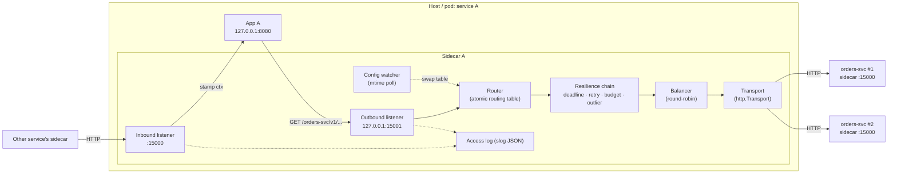
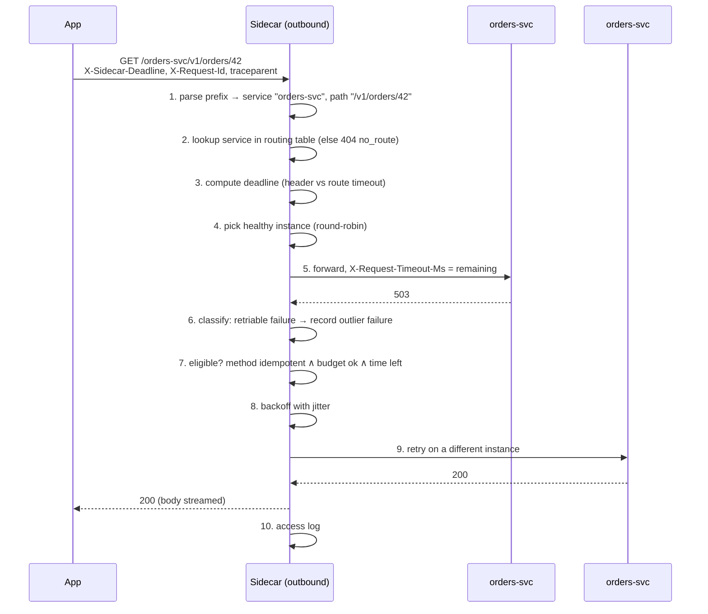
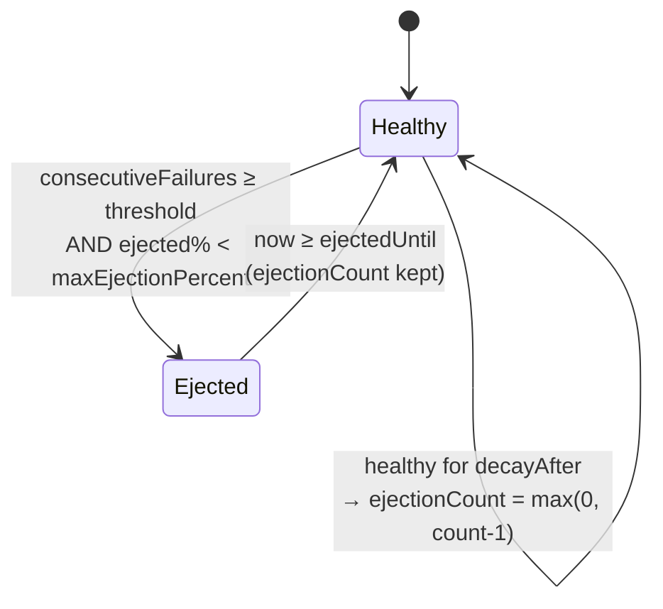

# Sidecar — Design Document

Status: **Draft v1** · Scope: learning project · Language: Go 1.26 (stdlib + `gopkg.in/yaml.v3`)

Related: [CONFIG.md](CONFIG.md) (configuration reference) · [QUESTIONS.md](QUESTIONS.md) (decisions log & open questions)

---

## 1. Overview

The sidecar is a small process that runs next to every service instance and handles
**service-to-service HTTP communication** on the app's behalf:

- **Outbound**: the app calls `http://127.0.0.1:15001/<service>/<path>`; the sidecar resolves
  `<service>` to a set of instances, load-balances, enforces deadlines, retries safely and
  ejects unhealthy instances.
- **Inbound (minimal pass-through)**: other services reach this app through the sidecar's
  public port `:15000`; the sidecar stamps request context (request id, trace, deadline),
  forwards to the app on `127.0.0.1:8080` and writes an access log.

### 1.1 Goals (v1)

| # | Goal |
|---|------|
| G1 | Explicit HTTP/1.1 proxy with path-prefix addressing |
| G2 | Static YAML service discovery with safe hot reload |
| G3 | Round-robin load balancing over healthy instances |
| G4 | Per-instance outlier ejection |
| G5 | Safe retries (idempotent only) protected by a retry budget |
| G6 | End-to-end deadline propagation |
| G7 | Request context stamping on inbound (`X-Request-Id`, `traceparent`, deadline) |
| G8 | Structured JSON access logs |
| G9 | Clear error model distinguishing sidecar failures from upstream failures |
| G10 | Modular protocol layer so gRPC/TCP can be added later without rewrites |

### 1.2 Non-goals (v1)

- Transparent interception (iptables), raw TCP, gRPC/HTTP2, messaging.
- TLS / mTLS (a `Transport` seam is reserved for it).
- Prometheus metrics, OpenTelemetry export, admin API (logs only).
- Dynamic discovery (Kubernetes, Consul) or a control plane.
- Inbound auth, rate limiting, request/response transformation.
- Correlating an inbound request with the app's outbound calls (impossible without app help — see §4).

---

## 2. Architecture



Key point: **upstream instances are other sidecars' inbound ports**, not apps directly. Every
hop is therefore sidecar → sidecar, which is what makes deadline and context propagation
consistent across the mesh.

### 2.1 Ports

| Listener | Default bind | Who connects | Purpose |
|---|---|---|---|
| inbound | `0.0.0.0:15000` | other sidecars | public entry to this app |
| outbound | `127.0.0.1:15001` | local app only | app's gateway to other services |
| app | `127.0.0.1:8080` | inbound listener | the real service (must bind localhost only) |

The outbound listener **must** bind to loopback — otherwise anyone on the network could use
the sidecar as an open proxy into the mesh.

---

## 3. Request lifecycle

### 3.1 Outbound



Steps in detail:

1. **Parse prefix.** First path segment = service name. `/orders-svc/v1/orders/42?x=1` →
   service `orders-svc`, upstream path `/v1/orders/42?x=1`. Empty or unknown segment →
   `404 no_route`.
2. **Route lookup** in the current immutable `*RoutingTable` (loaded once per request from an
   `atomic.Pointer`; the request uses that snapshot for its whole life).
3. **Deadline** — see §5.3.
4. **Pick instance** via the service's `Balancer`, skipping ejected instances and, on retries,
   the instances already tried (if any other is available).
5. **Forward** through `httputil.ReverseProxy`-style logic: strip hop-by-hop headers, append
   `X-Forwarded-For`, set `X-Request-Timeout-Ms`, per-attempt `context.WithDeadline`.
6. **Classify** the attempt result (§5.1) and report it to the `OutlierDetector`.
7. **Retry decision** (§5.2).
8. **Backoff** (§5.2.3), bounded by remaining deadline.
9. **Retry** or give up.
10. **Respond** — upstream response passes through untouched; sidecar-generated failures use
    the error model (§7). Log one access-log line per *request* (with attempt count), not per attempt.

### 3.2 Inbound

1. Accept request on `:15000`.
2. **Stamp context**:
   - `X-Request-Id`: keep if present and valid (≤ 128 chars, printable ASCII), else generate (random 16 bytes, hex).
   - `traceparent`: keep if valid W3C format, else generate a new trace; always generate a new parent-span id for this hop.
   - Deadline: read `X-Request-Timeout-Ms`; if absent/invalid use `inbound.defaultTimeout`; clamp to `inbound.maxTimeout`.
     Convert to an **absolute local deadline** and set `X-Sidecar-Deadline: <unix-ms>` for the app (§5.3).
3. Forward to the app with `context.WithDeadline`. If the deadline expires → `504 deadline_exceeded`.
4. Access log.

Inbound does **no** retries, load balancing or ejection — there is exactly one app.

---

## 4. App contract

The sidecar cannot know which inbound request caused a given outbound call (the app may
handle many requests concurrently on many goroutines). So propagation needs one small piece of
cooperation from every app:

> **When handling an incoming request, copy these headers from it onto every outbound call made
> through the sidecar:**
>
> | Header | Set by | Meaning |
> |---|---|---|
> | `X-Request-Id` | inbound sidecar | correlates logs across services |
> | `traceparent` | inbound sidecar | W3C trace context |
> | `X-Sidecar-Deadline` | inbound sidecar | absolute deadline in unix ms, **local clock** |
>
> Optionally set `Idempotency-Key` on POST requests that are safe to retry.

If the app does not forward them, things still work: the outbound sidecar starts a new
request id / trace and uses the route timeout. You only lose correlation and deadline shrinking.

Apps **address** services as `http://127.0.0.1:15001/<service>/<path>` and **must not** follow
upstream redirects blindly (see §10, `Location` rewriting).

---

## 5. Resilience semantics

### 5.1 Attempt classification

| Outcome | Retriable? | Counts as outlier failure? |
|---|---|---|
| Connection refused / reset before request written / DNS failure | yes (always safe, request not sent) | yes |
| Per-attempt timeout (no response headers in time) | yes, if method eligible | yes |
| `502`, `503`, `504` from upstream | yes, if method eligible | yes |
| Upstream response with `X-Sidecar-Error` (the *upstream sidecar* failed) | same as its status | no (the instance's sidecar is alive; its dependency failed) |
| `500`, other `5xx` | no | no (application bug, not instance health) |
| `429` | no | no |
| `4xx`, `2xx`, `3xx` | no | success (resets consecutive failures) |
| Client (app) cancelled | no | no |

### 5.2 Retries

#### 5.2.1 Eligibility — all must hold

1. Attempt classified retriable (§5.1).
2. Method is `GET`, `HEAD`, `OPTIONS`, `PUT`, `DELETE`, **or** `POST`/`PATCH` with a non-empty
   `Idempotency-Key` header. *Exception*: connection failures where the request was provably
   never written are retriable for any method.
3. Attempts so far `< retry.maxAttempts` (default 3 total attempts).
4. Request body is replayable: body size ≤ `retry.maxBodyBytes` (default 1 MiB). The sidecar
   buffers bodies up to that size; larger or unknown-length bodies are streamed and **not retried**.
5. Retry budget allows it (§5.2.2).
6. Remaining deadline after backoff ≥ `retry.minAttemptTime` (default 20 ms) — no point starting
   an attempt that cannot finish.

#### 5.2.2 Retry budget (per upstream service)

Prevents retry storms: when an upstream is overloaded, retries multiply its load.

- Keep two counters over a sliding window of `retry.budget.window` (default 10 s, 10 one-second buckets):
  `requests` (first attempts) and `retries`.
- A retry is allowed iff
  `retries < retry.budget.ratio × requests + retry.budget.minPerSecond × window_seconds`
  (defaults: ratio `0.2`, minPerSecond `3`).
- The floor lets low-traffic services still retry; the ratio caps extra load at ~20%.
- When denied, return the last upstream response as-is (if one exists) and log `retry_budget_exhausted`;
  if there was no response (connect failure), return `503` with `X-Sidecar-Error: retry_budget_exhausted`.

#### 5.2.3 Backoff

Full jitter exponential:

```
sleep = random(0, min(retry.backoff.max, retry.backoff.base × 2^(attempt-1)))
```

defaults: base `25ms`, max `250ms`. Sleep is `select`-ed against the request context so a
deadline or client cancel interrupts it.

### 5.3 Deadlines

Two header forms, because clocks differ between hosts but not within one host:

| Header | Where | Format | Why |
|---|---|---|---|
| `X-Request-Timeout-Ms` | **on the wire** between sidecars | remaining ms (integer) | immune to clock skew between machines |
| `X-Sidecar-Deadline` | **inside the host**, inbound sidecar → app → outbound sidecar | absolute unix ms | same clock; automatically accounts for time the app spent before calling out |

**Outbound computation** for a request:

```
now          = local clock
routeTimeout = service.timeout (default 5s)
if X-Sidecar-Deadline valid:   deadline = min(header, now + routeTimeout)
else if X-Request-Timeout-Ms:  deadline = now + min(header, routeTimeout)   // app talked to us with relative form
else:                          deadline = now + routeTimeout
if deadline <= now: 504 deadline_exceeded (no attempt made)

per attempt:
  attemptDeadline = min(deadline, now + service.perTryTimeout)   // perTryTimeout optional
  send X-Request-Timeout-Ms = attemptDeadline - now
```

**Worked example A → B → C** (route timeouts 5s everywhere, network ~5 ms per hop):

| t (ms) | Event | Budget |
|---|---|---|
| 0 | Client hits sidecar A inbound, no header | default inbound timeout 3000 → A-app gets `X-Sidecar-Deadline = t0+3000` |
| 400 | A-app calls B via outbound sidecar A, forwarding deadline | remaining 2600 → wire `X-Request-Timeout-Ms: 2600` |
| 405 | Sidecar B inbound | B-app deadline = local now + 2600 |
| 1405 | B-app (spent 1000 ms) calls C | remaining ~1600 → wire `1600` |
| 1410 | Attempt to C#1 fails fast with 503 at 1500; backoff 30 ms | remaining ~1070 |
| 1530 | Retry to C#2 with `1070` | … |
| 3000 | If still no response, every level times out together; nobody keeps working on a dead request | |

Without propagation, C would happily work for 5 s on a request A gave up on at 3 s.

### 5.4 Outlier ejection (per instance)



- `consecutiveFailures ≥ outlier.consecutiveFailures` (default 5) → eject.
- Ejection duration = `min(outlier.baseEjection × ejectionCount, outlier.maxEjection)`
  (defaults 30 s, 5 min). Repeat offenders stay out longer.
- **Max ejection percent** (default 50%): if ejecting would push ejected instances above this
  share of the pool, don't eject. With 1 instance, 50% means it is never ejected — deliberate:
  failing fast with no instances helps nobody.
- No active health checks in v1: an instance returns to the pool when its timer expires, and the
  next real request is the probe.
- State is stored per instance with `sync/atomic` counters and a small mutex for transitions.

### 5.5 Load balancing

Round-robin with an `atomic.Uint64` counter over the instance list; skip ejected (and, on retry,
already-tried) instances, scanning at most `len(instances)` positions. None available →
`503 no_healthy_upstream`.

---

## 6. Component design

Interfaces keep protocols, algorithms and config sources swappable.

```go
// Protocol is one proxied protocol (v1: "http"). gRPC/TCP later implement the same.
type Protocol interface {
    Name() string
    // ServeOutbound / ServeInbound block until ctx is cancelled, then drain.
    ServeOutbound(ctx context.Context, ln net.Listener, deps Deps) error
    ServeInbound(ctx context.Context, ln net.Listener, deps Deps) error
}

type Deps struct {
    Table  *atomic.Pointer[RoutingTable]
    Logger *slog.Logger
    Clock  Clock // injectable for tests
}

// RoutingTable is immutable once built.
type RoutingTable struct {
    Services map[string]*Service
}

type Service struct {
    Name      string
    Timeout   time.Duration
    PerTry    time.Duration
    Balancer  Balancer
    Retry     RetryPolicy
    Budget    *RetryBudget
    Instances []*Instance
}

type Instance struct {
    Addr    string            // "10.0.0.7:15000"
    Outlier *OutlierState     // carried over across reloads (see §8)
}

type Balancer interface {
    // Pick returns a healthy instance not in exclude, or nil.
    Pick(exclude map[*Instance]struct{}) *Instance
}

type RetryPolicy interface {
    ShouldRetry(req *http.Request, attempt int, res AttemptResult) bool
    Backoff(attempt int) time.Duration
}

type OutlierDetector interface {
    Report(inst *Instance, res AttemptResult)
    IsEjected(inst *Instance, now time.Time) bool
}

// Transport sends one attempt. v1 wraps *http.Transport; TLS/mTLS plugs in here.
type Transport interface {
    RoundTrip(*http.Request) (*http.Response, error)
}

// ConfigSource produces validated configs; v1 = file poller.
type ConfigSource interface {
    Watch(ctx context.Context) <-chan *config.Config
}

type AttemptResult struct {
    Status      int
    Err         error
    Class       Class // Success, ConnectFailure, Timeout, GatewayError, NonRetriable
    RequestSent bool
}
```

### 6.1 Package layout

```
cmd/sidecar/            main: flags, load config, start listeners, signal handling
internal/config/        YAML structs, defaults, validation, file poller (ConfigSource)
internal/routing/       RoutingTable build from config, state carry-over
internal/balancer/      round-robin
internal/resilience/    deadline, retry policy, retry budget, outlier detector
internal/proxy/http/    HTTP Protocol: outbound handler, inbound handler, header utils
internal/errors/        sidecar error codes + JSON writer
internal/logging/       slog setup, access log helper
docs/                   this documentation
```

The existing root `main.go` moves to `cmd/sidecar/main.go` in M1.

---

## 7. Error model

Sidecar-originated responses always carry `X-Sidecar-Error` and a JSON body; upstream
responses pass through byte-for-byte (minus hop-by-hop headers).

```http
HTTP/1.1 503 Service Unavailable
Content-Type: application/json
X-Sidecar-Error: no_healthy_upstream
X-Request-Id: 7f3a...

{"code":"no_healthy_upstream","message":"all 3 instances of orders-svc are ejected","service":"orders-svc","requestId":"7f3a..."}
```

| Code | Status | When |
|---|---|---|
| `no_route` | 404 | unknown/empty service prefix |
| `no_healthy_upstream` | 503 | balancer returned nil |
| `upstream_connect_failed` | 502 | last attempt couldn't connect, no response to return |
| `deadline_exceeded` | 504 | deadline passed before or during attempts |
| `retry_budget_exhausted` | 503 | retry needed, budget denied, no response to return |
| `request_too_large` | 413 | body exceeds `limits.maxBodyBytes` |
| `app_unavailable` | 502 | inbound: local app not reachable |

Rule: **if the sidecar has a real upstream response, it returns it** rather than inventing an
error. Sidecar errors only happen when there is nothing better to return.

---

## 8. Configuration & hot reload

Config file format: see [CONFIG.md](CONFIG.md).

- A goroutine `stat`s the file every `reload.interval` (default 2 s). On mtime or size change it
  reads, parses, applies defaults and **validates** (§CONFIG validation rules).
- **Invalid** → log `config_rejected` with the error, keep serving the old table.
- **Valid** → build a new `RoutingTable` and `Store` it in the `atomic.Pointer`. Requests
  already running keep using their snapshot, so no request sees a half-updated table.
- **State carry-over**: outlier state and retry budgets are looked up by key
  (`service` for budgets, `service|addr` for instances) in the old table and reused. Removed
  instances drop their state; new instances start healthy. Round-robin counters reset (harmless).
- Listener addresses and the app address are **not** hot-reloadable (logged as a warning if changed;
  restart required).
- Connections to removed instances are closed by `Transport.CloseIdleConnections()` after the swap;
  in-flight requests to them complete normally.

---

## 9. Lifecycle

- **Startup**: load + validate config (invalid → exit 1). Bind listeners. Start watcher. Log `ready`.
- **Shutdown** on SIGINT/SIGTERM (Ctrl+C on Windows): stop accepting, `http.Server.Shutdown` with
  `shutdown.drainTimeout` (default 10 s) on both listeners in parallel, then force close.
  Inbound should drain **after** the app has stopped receiving new work, and outbound should stay up
  until the app finishes. v1 simplification: drain both together, outbound given the drain timeout + 5 s.

---

## 10. Known limitations / later work

- **Redirects**: upstream `Location: http://10.0.0.7:15000/v1/x` leaks instance addresses and bypasses
  the sidecar. v1 passes it through unchanged; later rewrite to `/<service>/v1/x`.
- **Streaming**: large/chunked bodies are not retried; response streaming (SSE) works but a per-attempt
  timeout only covers time to first byte headers, not the whole body.
- **No active health checks**, no half-open probing, no slow-start after un-ejection.
- **Logs only** — no metrics; debugging ejections relies on `instance_ejected` / `instance_restored` log events.
- **Plain HTTP** — any process on the network can call inbound; not safe outside a trusted network.
- **Clock jumps** on the local host affect `X-Sidecar-Deadline` (use monotonic time internally; the header is only an interchange format).

---

## 11. Access log format

One JSON line per request (slog `JSONHandler`):

```json
{"time":"2026-09-13T10:00:00.123Z","level":"INFO","msg":"access","dir":"outbound","requestId":"7f3a…","traceId":"4bf9…","method":"GET","service":"orders-svc","path":"/v1/orders/42","status":200,"attempts":2,"instances":["10.0.0.7:15000","10.0.0.8:15000"],"durationMs":184,"deadlineMs":2600,"sidecarError":""}
```

Event logs: `config_loaded`, `config_rejected`, `instance_ejected`, `instance_restored`,
`retry_budget_exhausted`, `shutdown_started`, `shutdown_complete`.

---

## 12. Implementation milestones

| M | Deliverable | Done when |
|---|---|---|
| M1 | `cmd/sidecar`, outbound HTTP proxy, path-prefix routing, single instance per service, static config at startup, error model | `curl 127.0.0.1:15001/echo/hello` reaches an echo server; unknown service → 404 `no_route` |
| M2 | Config validation, defaults, mtime hot reload with atomic swap | editing YAML changes routing without restart; broken YAML is rejected and logged |
| M3 | Multiple instances, round-robin, outlier ejection with max %, state carry-over | killing one of 3 echo servers → it gets ejected after 5 failures, traffic continues |
| M4 | Deadlines (both headers), retries with eligibility rules, body buffering, budget, backoff | table-driven tests with fake clock + `httptest` servers cover every row of §5.1/§5.2 |
| M5 | Inbound listener: context stamping, app forwarding, access logs everywhere, graceful shutdown | request id and deadline observed shrinking across a 3-service chain |
| M6 | `docker-compose` demo: 3 toy services (A→B→C) each with a sidecar + chaos flags on C (latency, error rate) | README walkthrough reproduces retries, ejection and deadline propagation |

Testing approach: `httptest.Server` upstreams, injectable `Clock`, `-race` on everything,
one end-to-end test that spins up two sidecars in-process.
