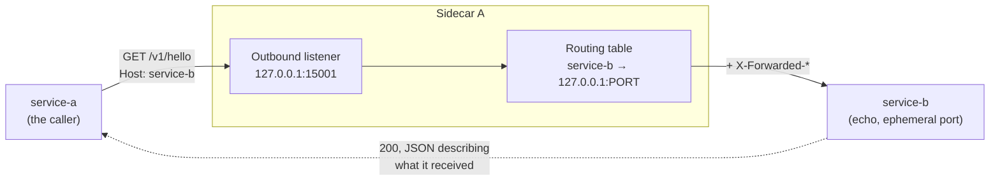

# End-to-end example: service A → sidecar → service B

Two toy services and a real sidecar, wired together so one request can be followed the whole way
across. Same harness serves both entry points: a demo you watch, and a test suite that fails
when routing or the error model breaks.

Related: [../docs/DESIGN.md](../docs/DESIGN.md) · [../docs/TODO.md](../docs/TODO.md) · [../docs/QUESTIONS.md](../docs/QUESTIONS.md)

---

## Run it

```bash
go run ./e2e/demo          # an A→B round trip and a timeout, step by step; exits non-zero if either misbehaves
go run ./e2e/demo -hold    # same, then stays up on 127.0.0.1:15001 so you can send your own
go test ./e2e/ -race -v    # the automated version, on ephemeral ports
```

With `-hold` running:

```bash
curl -is -H 'Host: service-b'    http://127.0.0.1:15001/v1/hello   # 200, echoed request
curl -is -H 'Host: slow-service' http://127.0.0.1:15001/v1/hello   # 504, deadline_exceeded after 200ms
curl -is -H 'Host: nope'         http://127.0.0.1:15001/v1/hello   # 404, no_route
```

## What runs where



Everything runs in one process as goroutines, but each service is a real `net/http` server on a
real loopback port, so the sidecar hop is a genuine TCP connection.

Service B echoes back what it received — path, `Host`, `X-Forwarded-*` — which is what makes both
the demo output and the test assertions mean something: they describe the far side of the hop,
not what the caller sent.

### The hop that is missing

DESIGN §2 has every hop going sidecar → sidecar: A's outbound listener should be talking to B's
*inbound* listener on `:15000`, which then forwards to B's app on `127.0.0.1:8080`. There is no
inbound listener yet ([TODO.md](../docs/TODO.md) P1), so A's sidecar talks to B's app directly.
When inbound lands, it slots in front of `StartEcho` in [harness.go](harness.go) and nothing in
the tests needs to change.

## What this covers

| Test | What it pins down |
|---|---|
| `TestRequestFromAToB` | the round trip: B is reached by name, sees the right path, gets `X-Forwarded-For`. Runs per addressing form — `host header`, `proxy style` (absolute URI), and `path kept verbatim` |
| `TestUnknownService` | 404 `no_route` with the §7 JSON body, and B is not called |
| `TestUpstreamDown` | route exists, nothing listening → 502 `upstream_connect_failed` |
| `TestRoundRobin` | two instances of one service split requests evenly |
| `TestDeadlineExceeded` | an upstream slower than the service's timeout → 504 `deadline_exceeded`, *fast* |
| `TestSlowButWithinBudget` | a slow upstream that still answers in time is not cut off |
| `TestNoInstances` | a service with an empty instance list → 503 `no_healthy_upstream`, not 404 |

With a control plane (`discovery_test.go`: an in-process control plane, and full sidecars that
register their echo app and long-poll for snapshots — the wiring `cmd/sidecar` runs):

| Test | What it pins down |
|---|---|
| `TestDiscoveredRoute` | nothing lists service-b anywhere; A reaches it once B's sidecar registers; A's `/readyz` goes 200 |
| `TestScaleOutAndIn` | a second instance is picked up, and a gracefully stopped one leaves every table at once |
| `TestUnhealthyAppLeavesTheMesh` | an app failing its health check is deregistered, and returns when it recovers |
| `TestDeclaredServiceWithNoInstances` | a service `mesh.yaml` names but nobody runs → 503, not 404 |
| `TestPolicyFromMeshFile` | per-service timeout comes from the control plane's file, and an edit applies with no restart |
| `TestNotReadyBeforeFirstSnapshot` | before any snapshot: 503 `mesh_not_ready`, `/readyz` 503, `/healthz` 200, registration proceeds |
| `TestControlPlaneRestart` | routes survive the control plane going down; a restarted one warms up before serving, so nothing is dropped |

Not covered, because none of it exists yet: deadline propagation between hops, outlier
ejection, retry budgets, inbound context stamping. Those are P1 in
[TODO.md](../docs/TODO.md), and this folder is where their end-to-end tests should go —
`StartSlowEcho` is the first of the failure modes `Echo` will grow (flaky, 503), and
`config.Service` (built with `config.NewService`) is where per-service policy hangs.

## Addressing

A service is named in the **`Host` header** (decision D1 in [../docs/QUESTIONS.md](../docs/QUESTIONS.md)):
[`serviceName`](../internal/proxy/proxy.go#L41-L50) reads `r.URL.Host` (the absolute-URI form an
HTTP proxy receives) and falls back to `r.Host`. Two ways to say the same thing:

```bash
curl -H 'Host: service-b' http://127.0.0.1:15001/v1/hello   # name it per request
http_proxy=http://127.0.0.1:15001 curl http://service-b/v1/hello   # or configure the proxy once
```

There is no path prefix. The sidecar claims no part of the app's URL space, so paths, redirects
and cookies pass through without rewriting — `curl .../service-b/v1/hello` is a *path* on
whatever service the Host names, not a route to `service-b`.

`Call()` in [harness.go](harness.go) is the only place this is written down, deliberately.

## When you implement these, change this folder

| TODO item | What changes here |
|---|---|
| Demo on the control plane | `demo/main.go` still wires a static `routing.NewTable`; it could start a control plane and `StartMeshSidecar`s instead, like `discovery_test.go` |
| Inbound listener (P1) | put an inbound sidecar in front of `StartEcho` and assert `X-Request-Id` / deadline headers arrive at the app |
